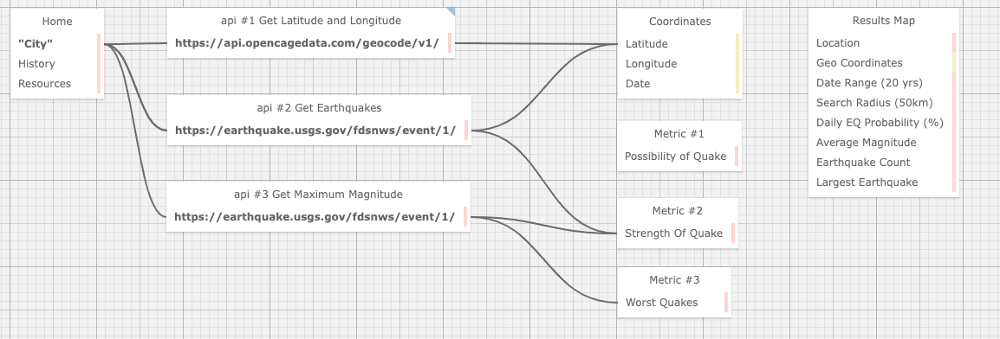

<h1 align="center"><strong>Quake Modeler</strong></h1>

<h4 align="center"><em>MVC program to query an Earthquake data API and produce aggregate information about earthquakes and their locations.</em></h4>

 

##### __Created:__ 8/24/2020
##### __Last Updated:__ 8/24/2020 
##### By _**Tyson Lackey, Thomas Glenn, JohnNils Olson, Evgeniya Chernaya, Frederick Ernest**_  

## Description
As a team-week project for Epicodus school we tasked ourselves with creating an application which would take a location from a user (city, county or state), and return the following:

* An interactive heat-map of earthquakes for the input region for the twenty years previous to date of inquiry;
* A list of these earthquakes with their respective latitudes and longitudes;
* The strength of these earthquakes (over a magnitude of 2.0);
* The probability that an earthquake would occur in the input region today.
    - probability = Total Earthquakes / 365 * 20 (20 year search range, average earthquakes per day)
* The average earthquake magnitude. 
    - Avg Magnitude = Sum of all quake magnitudes / total earthquakes
* Largest earthquake (Max magnitude in search range)

 

## Sitemap:

 

## Setup/Installation Requirements

##### &nbsp;&nbsp;&nbsp;&nbsp;&nbsp;&nbsp;Open via Bash/GitBash:

1. Clone this repository onto your computer:
    "git clone https://github.com/fetonecontrol/QuakeModler.Solution"
2. Navigate into the "QuakeModler.Solution" directory in Visual Studio Code or preferred text editor:
3. Open the project by typing "code ." while in the previous directory in your terminal.
4. Open your computer's terminal and navigate to the directory bearing the name of the program and containing the top level subdirectories and files.
5. Enter the command "dotnet build" in the terminal and press "Enter".
6. Enter the command "dotnet watch run" in the terminal and press "Enter".

## Known Bugs

* n/a

## Support and contact details

* Tyson Lackey <lackeyt90@gmail.com>
* Frederick Ernest <frederick.ernest@gmail.com>
* Evegeniya Chernaya <evgenya.chernaya@gmail.com>
* JohnNils Olson <johnnils@gmail.com>
* Tyson Lackey <lackeyt90@gmail.com>

## Technologies Used

* Visual Studio Code
* C#
* Entity Framework
* .NET Core
* Coordinates by Location API (https://opencagedata.com/api#request)
* Earthquake data API (https://earthquake.usgs.gov/fdsnws/event/1/)

### License

Copyright (c) 2020 **_Tyson Lackey, Thomas Glenn, JohnNils Olson, Evgeniya Chernaya, Frederick Ernest_**

This software is licensed under the MIT license.
